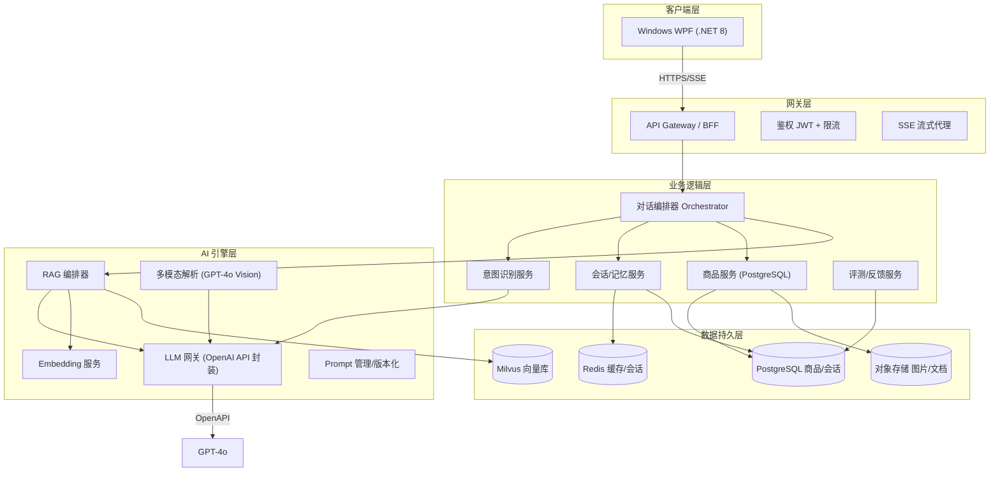
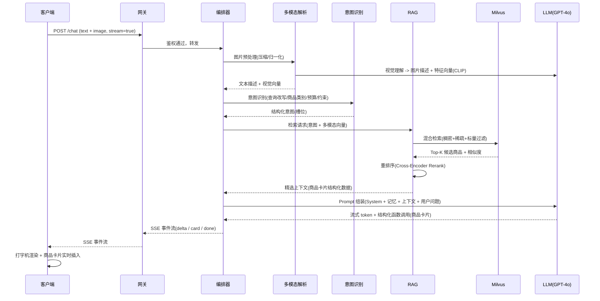
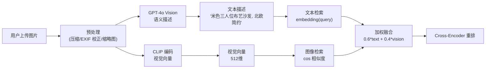
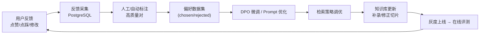

# SmartShop AI —— 电商智能导购 Agent 工程实施方案

> **技术选型（已确认）**
> - 客户端：Windows 端 WPF (.NET 8)，原生桌面客户端
> - 后端：Python + FastAPI（异步高并发 + AI 生态）
> - 向量数据库：Milvus（自托管，支持标量过滤 + 混合检索）
> - 关系型数据库：PostgreSQL（JSONB 支持好，适合商品半结构化数据）
> - AI 核心：GPT-4o（多模态 + 稳定的函数调用/工具调用）
> - 缓存/会话：Redis（SSE 会话态、热点缓存、限流）
> - 对象存储：MinIO / 云 OSS（商品图片、原始文档）

---

## 第一部分：系统架构设计

### 1.1 整体架构（分层）

系统采用 **五层架构**，层间通过明确的接口契约解耦，便于独立演进与水平扩容。



**分层职责说明**

| 层 | 职责 | 关键技术点 |
|---|---|---|
| 客户端层 | 渲染流式内容、多模态采集、交互动画 | WPF (XAML) + MVVM，SSE 消费 |
| 网关层 | 鉴权、限流、协议统一、SSE 长连接保持 | Nginx / Envoy / Kong，JWT |
| 业务逻辑层 | 编排对话流程、意图路由、会话管理、商品查询 | FastAPI 模块化 + DDD |
| AI 引擎层 | RAG 检索、Embedding、Prompt 组装、LLM 调用 | 独立部署，按需扩缩 |
| 数据持久层 | 向量/关系/缓存/文件四类存储 | 读写分离、索引优化 |

### 1.2 数据流转（端到端）

一次完整导购交互（以文字+图片为例）的全过程如下：



**关键决策点说明**

1. **意图识别放在检索前**：先结构化用户意图（品类、预算、尺寸、风格），把自然语言槽位转成 Milvus 的**标量过滤条件**（如 `price < 5000 AND category == "沙发"`），比单纯向量相似度召回精度高一个量级。
2. **图片双路处理**：图片既走 `GPT-4o Vision` 生成语义描述（用于文本检索），又走 `CLIP` 生成视觉向量（用于图像相似度检索），双路结果加权融合。
3. **重排序（Rerank）**：召回 50 条，经 Cross-Encoder 精排取 Top-5 送入 LLM，控制上下文长度与成本，同时大幅提升命中率。

---

## 第二部分：核心功能模块实现

### 2.1 知识库构建（RAG Pipeline）

#### 2.1.1 非结构化文档解析

商品详情和营销文档来源多样，需统一接入 **文档摄取管线（Ingestion Pipeline）**：

| 来源 | 解析工具 | 处理要点 |
|---|---|---|
| PDF 商品手册 | `PyMuPDF` / `pdfplumber` | 保留表格结构、页眉页脚去噪 |
| HTML 商品页 | `BeautifulSoup` / `trafilatura` | 提取正文 DOM，剥离脚本/CSS/广告 |
| 营销文档 (Word/MD) | `python-docx` / `markdown` | 保留标题层级作为切片边界 |
| 图片/扫描件 | OCR（PaddleOCR/云端） | 图片 → 文本后进入切片 |
| 表格 (Excel) | `openpyxl` | 直接转为结构化 KV 属性 |

**统一中间格式**：所有文档解析后归一化为带元数据的 `Document` 对象：

```python
from pydantic import BaseModel
from typing import Optional, Any

class Document(BaseModel):
    doc_id: str                    # 唯一 ID
    source_type: str               # pdf / html / docx / image
    title: str                     # 标题
    content: str                   # 归一化文本/HTML
    metadata: dict[str, Any]       # 类目、品牌、SKU、价格、来源 URL 等
    attributes: Optional[dict]     # 抽取出的结构化参数(见 2.1.2)
```

#### 2.1.2 文本切片策略（针对商品属性的特殊处理）

商品详情页与普通文章不同：**参数表（规格）是短而关键的 KV 对，描述是长文本**。一刀切的固定长度切片会破坏参数语义。因此采用**双轨切片**：

1. **属性切片（Attribute Chunks）**：先从详情中抽取结构化参数（品牌、材质、尺寸、颜色、能效等），每个 `(key, value)` 独立成一条小切片，并存入 Milvus 的**标量字段**，支持精确过滤。

```python
def split_product_attributes(attrs: dict) -> list[Chunk]:
    """属性级切片：每条参数一个 chunk，chunk 即最小检索单元"""
    chunks = []
    for key, value in attrs.items():
        chunks.append(Chunk(
            text=f"{key}: {value}",           # 便于语义检索
            chunk_type="attribute",
            scalar_fields={                    # 用于标量过滤/精确匹配
                "attr_key": key,
                "attr_value": value,
            },
            priority=10,                        # 属性权重最高
        ))
    return chunks
```

2. **描述切片（Semantic Chunks）**：对描述长文本，结合**标题层级 + 语义边界 + 滑动窗口**切片，目标 300~500 token，重叠 10%~15%，避免截断关键信息。

```python
def split_description(text: str) -> list[Chunk]:
    """描述级切片：按标题+句子语义边界切，重叠滑窗"""
    segments = semantic_split(text, max_tokens=400, overlap_tokens=50)
    return [Chunk(text=s, chunk_type="description", priority=5) for s in segments]
```

**切片优先级**：检索时 `attribute` chunk 的相似度得分乘更高权重，确保"参数类问题"（如"这款沙发是什么材质"）命中参数切片而非长篇描述。

#### 2.1.3 Embedding 模型选择与索引构建

**Embedding 选型**（中文电商场景优先）：

| 模型 | 维度 | 特点 | 推荐场景 |
|---|---|---|---|
| `text-embedding-3-large` | 3072 (可压缩) | OpenAI 官方，多语言，Matryoshka 可降维 | 主选，稳定 |
| `BGE-M3` / `bge-large-zh` | 1024 | 开源中文最优，支持稠密+稀疏联合 | 私有化部署备选 |
| `CLIP (ViT-B/32)` | 512 | 图文对齐，用于图片向量 | 多模态图搜 |

**索引构建策略（Milvus）**：

- **Collection 设计**：一个 `product` collection，含 `embedding` 向量字段 + 标量字段（`category`、`brand`、`price`、`attr_key`、`attr_value`、`sku`）。
- **索引**：向量字段用 `HNSW`（`M=16, efConstruction=256`），标量字段建倒排/字典索引。
- **混合检索**：`稠密向量相似度 (dense) + 稀疏检索 (sparse/BM25) + 标量过滤 (scalar)`，三者通过 Milvus 原生 `Hybrid Search` 或应用层 `RRF (Reciprocal Rank Fusion)` 融合。

```python
# Milvus collection schema 关键片段
from pymilvus import CollectionSchema, FieldSchema, DataType

fields = [
    FieldSchema("id", DataType.INT64, is_primary=True),
    FieldSchema("doc_id", DataType.VARCHAR, max_length=128),
    FieldSchema("chunk_type", DataType.VARCHAR, max_length=32),
    FieldSchema("category", DataType.VARCHAR, max_length=64),
    FieldSchema("brand", DataType.VARCHAR, max_length=64),
    FieldSchema("price", DataType.DOUBLE),
    FieldSchema("attr_key", DataType.VARCHAR, max_length=64),
    FieldSchema("attr_value", DataType.VARCHAR, max_length=256),
    FieldSchema("embedding", DataType.FLOAT_VECTOR, dim=1024),
    FieldSchema("sparse_vector", DataType.SPARSE_FLOAT_VECTOR),  # 稀疏向量
]
```

#### 2.1.4 向量库选型理由（Pros/Cons）

**结论：选择 Milvus**。对比分析：

| 候选 | Pros | Cons | 结论 |
|---|---|---|---|
| **Milvus** ✅ | 千万级规模、原生混合检索(hybrid)、丰富标量过滤、HNSW/IVF 多索引、自托管数据可控、社区活跃 | 部署运维成本较高（需 etcd/MinIO 依赖）、学习曲线陡 | **生产首选** |
| Weaviate | 自带对象存储、GraphQL 查询、内置 hybrid search、部署简单 | 大规模场景性能与 Milvus 有差距、生态较小 | 中小规模备选 |
| Pinecone | 全托管零运维、上手最快、易扩缩 | 数据在外部（合规风险）、成本随规模线性上升、自定义过滤受限 | 快速验证期可用 |
| Chroma | 极轻量、嵌入式、秒级启动 | 不支持生产级并发/持久化、无标量过滤、无混合检索 | 仅限 POC |

> 电商场景商品库动辄百万级 SKU、每 SKU 数十个切片，需要**千万级向量规模 + 标量过滤 + 混合检索**，Milvus 是唯一同时满足且可自托管的选择。

### 2.2 多模态输入解析

#### 2.2.1 用户上传图片的处理方案

场景："帮我找一款和图片上类似的沙发"。



**关键实现要点**

1. **图片特征向量化**：图片经 `CLIP` 编码为 512 维向量，与知识库中商品主图预先计算好的 CLIP 向量做余弦相似度检索（`image-to-image`）。
2. **图文混合检索**：同时用 `GPT-4o Vision` 生成的语义描述去做文本检索（`text-to-text`），两路结果加权融合，避免"仅靠像素相似"漏掉"风格/材质相似但外观不同"的商品。
3. **预处理**：统一缩放至 `1024×1024` 以内、JPEG 压缩，降低传输与推理成本，并记录 EXIF 方向。

```python
async def parse_product_image(image_bytes: bytes) -> MultimodalQuery:
    """图片多模态解析：视觉向量 + 语义描述双路输出"""
    # 1. 预处理
    img = preprocess(image_bytes)                      # 缩放/纠偏/压缩
    # 2. CLIP 视觉向量
    vision_vec = await clip_embed(img)                  # 512 维
    # 3. GPT-4o Vision 语义描述
    description = await llm.vision(
        image=img,
        prompt="用简洁中文描述图中商品：品类、颜色、材质、风格、关键特征。",
    )
    return MultimodalQuery(
        text_query=description,      # 用于文本检索
        vision_vector=vision_vec,    # 用于图像检索
    )
```

### 2.3 大模型集成与 Prompt 工程

#### 2.3.1 System Prompt（专业导购顾问角色）

```text
你是「SmartShop AI」的资深导购顾问，拥有 10 年家居/消费零售经验。

【角色定位】
你温暖、专业、有同理心，像一位懂行又耐心的资深导购。

【核心原则】
1. 基于事实：只依据 <检索上下文> 提供的商品信息回答，绝不编造价格、参数、库存或链接。
   若上下文中没有足够信息，坦诚告知并给出进一步澄清的问题。
2. 决策辅助：不满足于罗列商品，要帮用户做"对比→权衡→推荐"，
   明确说明推荐理由与适用场景。
3. 引导澄清：当用户需求模糊（预算、尺寸、风格、场景）时，
   用不超过 2 个关键问题主动澄清，而非一次性抛出一堆问题。
4. 同理心：理解用户的预算焦虑与决策纠结，语气不生硬，不推销。

【结构化输出要求】
- 推荐商品时，必须通过 `product_card` 工具调用输出结构化商品卡片
  （含名称、价格、评分、图片 URL、商品链接），不要只用纯文本描述商品。
- 涉及价格、参数等关键信息，务必引用来源商品。

【行为边界】
- 不做竞品恶意贬损，不承诺不确定的优惠/库存。
- 涉及健康、安全、合规（如母婴、食品）时，提示用户以官方说明为准。

【输出风格】
- 中文，简洁分段，先给结论再展开。
- 金额统一使用「¥」符号，价格保留两位小数。
```

#### 2.3.2 上下文记忆机制（多轮对话）

采用**三级记忆**，兼顾实时性与成本：

| 级别 | 存储 | 内容 | 用途 |
|---|---|---|---|
| 短期记忆 | Redis (会话内) | 最近 N 轮原始对话 | 直接拼入 Prompt 上下文 |
| 工作记忆 | Redis | 当前会话的槽位状态（品类/预算/尺寸/已推荐 SKU） | 避免重复提问、去重 |
| 长期记忆 | PostgreSQL + 向量库 | 用户画像、历史偏好、购买历史摘要 | 跨会话个性化推荐 |

**上下文窗口管理**（防止超长与成本失控）：

```python
def build_context(memory: Memory, query: str, retrieved: list[Chunk]) -> list[Message]:
    """滑动窗口 + 摘要压缩 + 检索上下文拼装"""
    msgs = [SystemMessage(SYSTEM_PROMPT)]

    # 工作记忆：会话槽位
    msgs.append(HumanMessage(f"[用户当前偏好] {memory.slots.to_str()}"))

    # 短期记忆：滑动窗口最近 6 轮 + 更早内容的摘要
    recent, older = memory.split_recent(n=6)
    if older:
        msgs.append(HumanMessage(f"[对话摘要] {summarize(older)}"))
    msgs.extend(recent)

    # 检索上下文（重排后 Top-K）
    msgs.append(HumanMessage(f"[检索上下文]\n{format_context(retrieved)}"))

    # 当前用户输入
    msgs.append(HumanMessage(query))
    return msgs
```

#### 2.3.3 函数调用（结构化商品卡片）

通过 `function calling` 让模型输出结构化商品数据，而非让模型"用文字模拟 JSON"：

```python
tools = [{
    "type": "function",
    "function": {
        "name": "product_card",
        "description": "向用户展示一个结构化商品推荐卡片",
        "parameters": {
            "type": "object",
            "properties": {
                "name": {"type": "string", "description": "商品名称"},
                "price": {"type": "number", "description": "售价(元)"},
                "rating": {"type": "number", "description": "评分 0-5"},
                "image_url": {"type": "string", "description": "商品主图 URL"},
                "product_url": {"type": "string", "description": "商品详情链接"},
                "sku": {"type": "string", "description": "SKU 编码"},
                "highlights": {"type": "array", "items": {"type": "string"},
                               "description": "卖点列表"}
            },
            "required": ["name", "price", "product_url", "sku"]
        }
    }
}]
```

### 2.4 流式交互与 UI 渲染

#### 2.4.1 传输协议选型：SSE vs WebSocket

| 维度 | SSE | WebSocket |
|---|---|---|
| 方向 | 单向（服务端→客户端） | 双向 |
| 实现复杂度 | 低（普通 HTTP） | 高（需心跳/重连管理） |
| 断线重连 | 浏览器自动 | 需手动实现 |
| 穿透网关/代理 | 容易 | 需特殊配置 |
| 适用场景 | **LLM 单向流式输出（本场景）** | 需要客户端持续上行 |

**结论：选择 SSE**。导购对话是"一问一答"的请求-响应模式，模型输出是单向流，SSE 足够且更简单可靠。

#### 2.4.2 SSE 事件协议设计

服务端按事件类型下发不同数据包，客户端按类型分发渲染：

```text
event: meta
data: {"conversation_id":"...","message_id":"..."}

event: delta
data: {"content":"这款沙发采用"}

event: card
data: {"type":"product_card","data":{"name":"...","price":1999.00,...}}

event: intent
data: {"intent":"recommend","slots":{"category":"沙发"}}

event: error
data: {"code":5001,"message":"检索服务超时"}

event: done
data: {"usage":{"prompt_tokens":1234,"completion_tokens":567}}
```

#### 2.4.3 客户端流式接收关键代码

**Windows (WPF / C#)**：

```csharp
// ChatStream.cs —— 基于 HttpClient 的 SSE 流式解析
public class ChatStream
{
    private readonly HttpClient _http = new() { Timeout = Timeout.InfiniteTimeSpan };

    public async Task SendAsync(ChatInput input,
        Action<string> onDelta,
        Action<ProductCard> onCard,
        Action onDone,
        CancellationToken ct = default)
    {
        var json = JsonSerializer.Serialize(input);
        var req = new HttpRequestMessage(HttpMethod.Post, $"{Api.BaseUrl}/chat")
        {
            Content = new StringContent(json, Encoding.UTF8, "application/json")
        };

        using var resp = await _http.SendAsync(req, HttpCompletionOption.ResponseHeadersRead, ct);
        await using var stream = await resp.Content.ReadAsStreamAsync(ct);
        using var reader = new StreamReader(stream);

        string? line;
        while ((line = await reader.ReadLineAsync(ct)) is not null)
        {
            if (!line.StartsWith("data: ")) continue;
            var payload = line[6..];
            if (payload == "[DONE]") break;
            Dispatch(payload, onDelta, onCard);
        }
        onDone();
    }

    private static void Dispatch(string payload,
        Action<string> onDelta, Action<ProductCard> onCard)
    {
        using var doc = JsonDocument.Parse(payload);
        var root = doc.RootElement;
        var ev = root.GetProperty("event").GetString();
        switch (ev)
        {
            case "delta":
                onDelta(root.GetProperty("content").GetString() ?? "");
                break;
            case "card":
                onCard(root.GetProperty("data").Deserialize<ProductCard>()!);
                break;
        }
    }
}
```

#### 2.4.4 商品卡片原生 UI 组件

**结构化数据实时渲染**：客户端维护「文本缓冲 + 卡片队列」，收到 `delta` 追加到文本缓冲，收到 `card` 事件则把卡片插入到对应位置，实现"文本流中实时插入结构化商品卡片"。

```xml
<!-- ProductCard.xaml —— WPF 商品卡片 UserControl -->
<UserControl x:Class="SmartShop.UI.Components.ProductCard"
             xmlns="http://schemas.microsoft.com/winfx/2006/xaml/presentation"
             xmlns:x="http://schemas.microsoft.com/winfx/2006/xaml">
    <Border Background="#F5F5F5" CornerRadius="12" Padding="12" Width="320">
        <StackPanel>
            <Image x:Name="ProductImage" Height="160" Stretch="UniformToFill">
                <Image.Clip>
                    <RectangleGeometry Rect="0,0,296,160" RadiusX="8" RadiusY="8"/>
                </Image.Clip>
            </Image>
            <TextBlock x:Name="NameText" FontWeight="SemiBold" FontSize="15"
                       TextWrapping="Wrap" MaxHeight="40"
                       TextTrimming="CharacterEllipsis" Margin="0,8,0,0"/>
            <DockPanel Margin="0,6,0,0">
                <TextBlock x:Name="PriceText" FontSize="18" Foreground="#E64545"
                           FontWeight="Bold" DockPanel.Dock="Left"/>
                <TextBlock x:Name="RatingText" Foreground="#FF8C00" FontSize="13"
                           HorizontalAlignment="Right" Text="★ 4.8"/>
            </DockPanel>
        </StackPanel>
    </Border>
</UserControl>
```

```csharp
// ProductCard.xaml.cs —— 数据绑定
public partial class ProductCard : UserControl
{
    public ProductCard()
    {
        InitializeComponent();
        DataContextChanged += (_, _) => Bind();
    }

    private void Bind()
    {
        if (DataContext is not ProductCardModel m) return;
        NameText.Text = m.Name;
        PriceText.Text = $"¥{m.Price:F2}";
        RatingText.Text = $"★ {m.Rating:F1}";
        ProductImage.Source = new BitmapImage(new Uri(m.ImageUrl));
    }
}
```

---

## 第三部分：Windows 端开发要点（WPF / .NET 8）

### 3.1 高性能大文本渲染

| 技术点 | 实现方式 |
|---|---|
| 列表虚拟化 | `ListBox`/`ItemsControl` 默认启用 `VirtualizingStackPanel`，仅渲染可见项 |
| 大文本渲染 | `TextBlock` 流式追加；用 `Run` 分段避免整块重排；`TextRenderingMode` 设为 `ClearType` |
| 增量更新 | `INotifyPropertyChanged` 仅通知当前消息项，配合节流避免高频 `OnPropertyChanged` |
| 性能监控 | Visual Studio 诊断工具 / dotTrace / `PresentationTraceSources` |

**关键策略**：流式文本到达时，用**分片 Buffer**（如 50ms 节流提交一次），避免每个 token 都触发一次 UI 刷新（高频刷新是卡顿主因）。

```csharp
// StreamingBuffer.cs —— 节流刷新，避免逐 token 触发 UI 重排
public class StreamingBuffer : INotifyPropertyChanged
{
    private string _visibleText = "";
    private string _pending = "";
    private long _lastFlush;

    public string VisibleText
    {
        get => _visibleText;
        private set { _visibleText = value; OnPropertyChanged(); }
    }

    public void Append(string token)
    {
        _pending += token;
        var now = Environment.TickCount64;
        if (now - _lastFlush > 50)   // 50ms 节流
        {
            VisibleText += _pending;
            _pending = "";
            _lastFlush = now;
        }
    }

    public event PropertyChangedEventHandler? PropertyChanged;
    private void OnPropertyChanged([CallerMemberName] string? name = null)
        => PropertyChanged?.Invoke(this, new PropertyChangedEventArgs(name));
}
```

### 3.2 图片加载优化

- **降采样**：`BitmapImage` 设置 `DecodePixelWidth` 按显示宽度解码，避免加载超大原图占用内存。
- **缓存**：内存 `Dictionary<Uri, BitmapSource>` + 磁盘缓存（`FileCache`），二次加载零网络。
- **异步加载**：`BitmapImage` 的 `StreamSource` + `CacheOption.OnLoad`，不阻塞 UI 线程。
- **渐进式**：占位骨架 → 低清缩略图 → 高清原图。

### 3.3 丝滑动画（对标豆包）

| 效果 | 实现方式 |
|---|---|
| 气泡进入 | `TranslateTransform`（Y 位移）+ `Opacity` 的 `DoubleAnimation` + `CubicEase` |
| 打字光标闪烁 | `TextBlock` 透明度 `AutoReverse` 无限循环动画 |
| 卡片展开 | `ScaleTransform` + `DoubleAnimation`，从 0.95 → 1.0 弹性进入 |
| 平滑滚动到底 | `ScrollViewer.ScrollToEnd()` 在 `Dispatcher.BeginInvoke` 中调用 |

```xml
<!-- 气泡进入动画：Loaded 触发，位移 + 淡入 -->
<Style TargetType="Border">
    <Setter Property="RenderTransform">
        <Setter.Value><TranslateTransform Y="20"/></Setter.Value>
    </Setter>
    <Style.Triggers>
        <EventTrigger RoutedEvent="Loaded">
            <BeginStoryboard>
                <Storyboard>
                    <DoubleAnimation Storyboard.TargetProperty="(UIElement.Opacity)"
                                     From="0" To="1" Duration="0:0:0.25"/>
                    <DoubleAnimation Storyboard.TargetProperty="(UIElement.RenderTransform).(TranslateTransform.Y)"
                                     From="20" To="0" Duration="0:0:0.25">
                        <DoubleAnimation.EasingFunction>
                            <CubicEase EasingMode="EaseOut"/>
                        </DoubleAnimation.EasingFunction>
                    </DoubleAnimation>
                </Storyboard>
            </BeginStoryboard>
        </EventTrigger>
    </Style.Triggers>
</Style>
```

---

## 第四部分：评测与反馈闭环

### 4.1 评测体系

| 指标 | 定义 | 目标值 | 测量方式 |
|---|---|---|---|
| **回答准确率** | 事实性正确（价格/参数/链接无幻觉） | ≥ 95% | LLM-as-Judge + 人工抽检 |
| **检索召回率** (Recall@K) | 相关商品出现在 Top-K 的比例 | Recall@10 ≥ 90% | 标注黄金集 |
| **检索命中率** (MRR) | 正确结果的平均倒数排名 | ≥ 0.8 | 黄金集 |
| **响应延迟** (TTFT) | 首 token 延迟 | ≤ 800ms | 埋点 |
| **端到端延迟** | 提问→完整回复 | ≤ 3s | 埋点 |
| **多轮连贯性** | 跨轮槽位记忆与指代消解 | ≥ 90% | RAGAS + 人工 |

**自动评测框架**：使用 `RAGAS`（忠实度 + 相关性）与 `LLM-as-Judge`，配合离线黄金数据集（人工标注 500~1000 条）做回归。

### 4.2 数据回流与 RLHF 闭环



**三个闭环层次**：

1. **Prompt 层（最快）**：根据差评聚类分析，迭代 System Prompt 措辞与 few-shot 示例；Prompt 版本化管理 + 灰度对比。
2. **检索层（中等）**：点踩样本中"检索失败"的案例回灌，优化切片策略、Embedding、重排阈值。
3. **模型层（最慢）**：积累足够 `(prompt, chosen, rejected)` 三元组后，用 **DPO（Direct Preference Optimization）** 微调模型（或蒸馏到小模型），比完整 RLHF 更轻量、工程上更可控。

> 采用"**DPO 优先，RLHF 兜底**"策略：DPO 无需 reward model，训练稳定、成本低，适合电商导购这种相对明确的偏好任务。

---

## 第五部分：交付物

### 5.1 目录结构

```text
smartshop-ai/
├── backend/                          # FastAPI 后端
│   ├── app/
│   │   ├── main.py                   # 应用入口
│   │   ├── config.py                 # 配置(环境变量)
│   │   ├── api/
│   │   │   ├── routes/
│   │   │   │   ├── chat.py           # 对话接口(SSE)
│   │   │   │   ├── feedback.py       # 反馈接口
│   │   │   │   └── products.py       # 商品接口
│   │   │   └── deps.py               # 依赖注入
│   │   ├── core/
│   │   │   ├── orchestrator.py       # 对话编排器
│   │   │   ├── intent.py             # 意图识别
│   │   │   ├── memory.py             # 会话记忆
│   │   │   └── security.py           # JWT 鉴权
│   │   ├── ai/
│   │   │   ├── llm.py                # LLM 网关(OpenAI 封装)
│   │   │   ├── prompt.py             # Prompt 模板/版本
│   │   │   ├── embedding.py          # Embedding 服务
│   │   │   └── vision.py             # 多模态解析
│   │   ├── rag/
│   │   │   ├── retriever.py          # 混合检索
│   │   │   ├── reranker.py           # 重排序
│   │   │   └── ingestion/
│   │   │       ├── parsers/          # PDF/HTML/OCR 解析
│   │   │       ├── chunker.py        # 切片
│   │   │       └── pipeline.py       # 摄取管线
│   │   ├── services/
│   │   │   ├── product_service.py    # 商品(PostgreSQL)
│   │   │   └── eval_service.py       # 评测
│   │   ├── models/                   # Pydantic 模型
│   │   └── db/
│   │       ├── postgres.py
│   │       ├── milvus.py
│   │       └── redis.py
│   ├── tests/                        # pytest
│   ├── docker-compose.yml            # Milvus/PostgreSQL/Redis
│   └── requirements.txt
├── windows/                          # Windows WPF 客户端 (.NET 8)
│   ├── SmartShop.sln
│   └── SmartShop/
│       ├── App.xaml                   # 应用入口
│       ├── App.xaml.cs
│       ├── MainWindow.xaml            # 主窗口(聊天界面)
│       ├── MainWindow.xaml.cs
│       ├── Models/
│       │   ├── ChatMessage.cs         # 消息模型
│       │   └── ProductCardModel.cs    # 商品卡片模型
│       ├── ViewModels/
│       │   ├── ViewModelBase.cs       # INotifyPropertyChanged 基类
│       │   └── ChatViewModel.cs       # 会话状态(MVVM)
│       ├── Network/
│       │   └── ChatStream.cs          # SSE 流式客户端
│       ├── Components/
│       │   └── ProductCard.xaml       # 商品卡片组件
│       └── SmartShop.csproj           # 项目文件
└── docs/
    └── prompts/                      # Prompt 版本
```

### 5.2 核心代码片段

#### 5.2.1 RAG 检索逻辑（混合检索 + 重排）

```python
# backend/app/rag/retriever.py
from pymilvus import Collection

class HybridRetriever:
    def __init__(self, col: Collection, reranker):
        self.col = col
        self.reranker = reranker

    async def retrieve(self, query: str, vision_vec=None, filters: dict | None = None,
                       top_k: int = 50, final_k: int = 5) -> list[Chunk]:
        # 1. 文本稠密向量检索
        text_vec = await embed(query)

        search_params = {"metric_type": "COSINE", "params": {"nprobe": 16}}
        expr = self._build_expr(filters)          # 标量过滤表达式

        dense_hits = self.col.search(
            data=[text_vec], anns_field="embedding",
            param=search_params, limit=top_k, expr=expr,
            output_fields=["doc_id", "chunk_type", "price", "sku"],
        )[0]

        # 2. 可选：图像向量检索（多模态场景）
        vision_hits = []
        if vision_vec is not None:
            vision_hits = self.col.search(
                data=[vision_vec], anns_field="vision_embedding",
                param=search_params, limit=top_k, expr=expr,
                output_fields=["doc_id"],
            )[0]

        # 3. RRF 融合两路结果
        fused = self._rrf_fusion(dense_hits, vision_hits, k=60)

        # 4. 属性切片加权 + Cross-Encoder 重排
        fused = self._apply_attribute_bonus(fused)
        reranked = await self.reranker.rerank(query, fused, top_n=final_k)
        return reranked

    def _rrf_fusion(self, *hit_lists, k=60) -> dict:
        """Reciprocal Rank Fusion 融合多路排序"""
        scores = {}
        for hits in hit_lists:
            for rank, hit in enumerate(hits):
                doc_id = hit.id
                scores[doc_id] = scores.get(doc_id, 0) + 1 / (k + rank + 1)
        return sorted(scores.items(), key=lambda x: -x[1])

    def _build_expr(self, filters: dict | None) -> str:
        """意图槽位 → Milvus 标量过滤表达式"""
        if not filters:
            return ""
        conds = []
        if "category" in filters:
            conds.append(f'category == "{filters["category"]}"')
        if "max_price" in filters:
            conds.append(f'price <= {filters["max_price"]}')
        if "brand" in filters:
            conds.append(f'brand == "{filters["brand"]}"')
        return " and ".join(conds) or ""
```

#### 5.2.2 LLM 调用封装（流式）

```python
# backend/app/ai/llm.py
from openai import AsyncOpenAI

class LLMGateway:
    def __init__(self):
        self.client = AsyncOpenAI(api_key=settings.openai_key)

    async def stream_chat(self, messages, tools=None) -> AsyncIterator[SSEEvent]:
        """封装流式调用，产出统一 SSE 事件"""
        stream = await self.client.chat.completions.create(
            model="gpt-4o",
            messages=messages,
            tools=tools,
            stream=True,
            temperature=0.7,
        )
        async for chunk in stream:
            delta = chunk.choices[0].delta
            if delta.tool_calls:
                # 结构化商品卡片 → card 事件
                for tc in delta.tool_calls:
                    yield SSEEvent("card", tc.function.arguments)
            elif delta.content:
                yield SSEEvent("delta", delta.content)
            if chunk.usage:
                yield SSEEvent("usage", chunk.usage.model_dump())
        yield SSEEvent("done", None)
```

#### 5.2.3 后端 SSE 接口（编排器整合）

```python
# backend/app/api/routes/chat.py
from fastapi import APIRouter
from fastapi.responses import StreamingResponse

router = APIRouter()

@router.post("/chat")
async def chat(req: ChatRequest):
    async def event_stream():
        # 1. 意图识别
        intent = await orchestrator.detect_intent(req.message)
        yield sse("intent", intent.model_dump())

        # 2. 多模态解析（若有图片）
        mm = None
        if req.image:
            mm = await orchestrator.parse_image(req.image)

        # 3. RAG 检索
        chunks = await orchestrator.retrieve(
            req.message, vision_vec=mm.vision_vector if mm else None,
            filters=intent.slots,
        )

        # 4. 组装上下文 + 记忆
        messages = orchestrator.build_context(req.conversation_id, req.message, chunks)

        # 5. 流式输出（LLM）
        async for ev in llm.stream_chat(messages, tools=TOOLS):
            yield sse(ev.event, ev.data)

        # 6. 落库会话记忆
        await orchestrator.save_memory(req.conversation_id, req.message, "assistant")

    return StreamingResponse(
        event_stream(),
        media_type="text/event-stream",
        headers={"Cache-Control": "no-cache", "X-Accel-Buffering": "no"},
    )
```

#### 5.2.4 客户端会话状态（WPF 完整示例，MVVM）

```csharp
// windows/SmartShop/ViewModels/ChatViewModel.cs
using System.Collections.ObjectModel;
using SmartShop.Network;
using SmartShop.Models;

public class ChatViewModel : ViewModelBase
{
    private readonly ChatStream _stream = new();
    private ChatMessage? _reply;
    private string _pending = "";
    private long _lastFlush;

    public ObservableCollection<ChatMessage> Messages { get; } = new();
    public bool IsSending { get; private set; }

    public ChatViewModel()
    {
        _stream.OnDelta = AppendDelta;
        _stream.OnCard = card => _reply?.Cards.Add(card);
        _stream.OnDone = Finish;
    }

    public async Task SendAsync(string text, string? imageBase64, string conversationId)
    {
        Messages.Add(new ChatMessage { Role = "user", Text = text });
        _reply = new ChatMessage { Role = "assistant", IsStreaming = true };
        Messages.Add(_reply);
        IsSending = true;
        _pending = "";
        _lastFlush = 0;

        // 注意：ChatStream 回调在 UI SynchronizationContext 上执行，可安全更新集合
        await _stream.SendAsync(
            new ChatInput { Message = text, Image = imageBase64, ConversationId = conversationId });
    }

    private void AppendDelta(string token)
    {
        _pending += token;
        if (Environment.TickCount64 - _lastFlush > 50)   // 50ms 节流
        {
            Flush();
            _lastFlush = Environment.TickCount64;
        }
    }

    private void Finish()
    {
        Flush();
        if (_reply is not null) _reply.IsStreaming = false;
        IsSending = false;
        _reply = null;
    }

    private void Flush()
    {
        if (_reply is not null && _pending.Length > 0)
        {
            _reply.Text += _pending;
            _pending = "";
        }
    }
}
```

```csharp
// windows/SmartShop/Models/ChatMessage.cs
public class ChatMessage : ViewModelBase
{
    public string Role { get; set; } = "";
    public string Text { get => _text; set { _text = value; OnPropertyChanged(); } }
    public ObservableCollection<ProductCardModel> Cards { get; } = new();
    public bool IsStreaming { get => _streaming; set { _streaming = value; OnPropertyChanged(); } }
    private string _text = "";
    private bool _streaming;
}
```

#### 5.2.5 主窗口聊天界面（WPF XAML）

```xml
<!-- windows/SmartShop/MainWindow.xaml -->
<Window x:Class="SmartShop.MainWindow"
        xmlns="http://schemas.microsoft.com/winfx/2006/xaml/presentation"
        xmlns:x="http://schemas.microsoft.com/winfx/2006/xaml"
        xmlns:components="clr-namespace:SmartShop.Components"
        Title="SmartShop AI" Height="720" Width="480">
    <DockPanel>
        <!-- 消息列表（虚拟化） -->
        <ScrollViewer x:Name="MsgScroll">
            <ItemsControl ItemsSource="{Binding Messages}"
                          VirtualizingPanel.IsVirtualizing="True">
                <ItemsControl.ItemTemplate>
                    <DataTemplate>
                        <ContentControl>
                            <ContentControl.Style>
                                <Style TargetType="ContentControl">
                                    <Style.Triggers>
                                        <DataTrigger Binding="{Binding Role}" Value="user">
                                            <Setter Property="ContentTemplate">
                                                <Setter.Value>
                                                    <DataTemplate>
                                                        <Border Background="#E3F2FD" CornerRadius="10"
                                                                Padding="10" HorizontalAlignment="Right"
                                                                MaxWidth="320" Margin="0,6">
                                                            <TextBlock Text="{Binding Text}" TextWrapping="Wrap"/>
                                                        </Border>
                                                    </DataTemplate>
                                                </Setter.Value>
                                            </Setter>
                                        </DataTrigger>
                                        <DataTrigger Binding="{Binding Role}" Value="assistant">
                                            <Setter Property="ContentTemplate">
                                                <Setter.Value>
                                                    <DataTemplate>
                                                        <StackPanel HorizontalAlignment="Left"
                                                                    MaxWidth="380" Margin="0,6">
                                                            <TextBlock Text="{Binding Text}" TextWrapping="Wrap"/>
                                                            <ItemsControl ItemsSource="{Binding Cards}">
                                                                <ItemsControl.ItemTemplate>
                                                                    <DataTemplate>
                                                                        <components:ProductCard/>
                                                                    </DataTemplate>
                                                                </ItemsControl.ItemTemplate>
                                                            </ItemsControl>
                                                        </StackPanel>
                                                    </DataTemplate>
                                                </Setter.Value>
                                            </Setter>
                                        </DataTrigger>
                                    </Style.Triggers>
                                </Style>
                            </ContentControl.Style>
                        </ContentControl>
                    </DataTemplate>
                </ItemsControl.ItemTemplate>
            </ItemsControl>
        </ScrollViewer>
        <!-- 输入栏 -->
        <DockPanel DockPanel.Dock="Bottom" Margin="8">
            <Button x:Name="SendBtn" DockPanel.Dock="Right" Content="发送"
                    Width="72" Click="SendBtn_Click"/>
            <Button x:Name="ImageBtn" DockPanel.Dock="Right" Content="图"
                    Width="40" Click="ImageBtn_Click"/>
            <TextBox x:Name="InputBox" TextWrapping="Wrap" AcceptsReturn="True"
                     KeyDown="InputBox_KeyDown"/>
        </DockPanel>
    </DockPanel>
</Window>
```

```csharp
// windows/SmartShop/MainWindow.xaml.cs —— 发送与滚动
public partial class MainWindow : Window
{
    private readonly ChatViewModel _vm = new();

    public MainWindow()
    {
        InitializeComponent();
        DataContext = _vm;
    }

    private async void SendBtn_Click(object sender, RoutedEventArgs e) => await SendText();

    private async void InputBox_KeyDown(object sender, KeyEventArgs e)
    {
        if (e.Key == Key.Enter && Keyboard.Modifiers.HasFlag(ModifierKeys.Shift) == false)
        {
            e.Handled = true;
            await SendText();
        }
    }

    private async Task SendText()
    {
        var text = InputBox.Text.Trim();
        if (text.Length == 0) return;
        InputBox.Text = "";
        await _vm.SendAsync(text, _selectedImageBase64, _conversationId);
        _selectedImageBase64 = null;
        MsgScroll.ScrollToEnd();   // 平滑滚动到底
    }

    private string? _selectedImageBase64;
    private readonly string _conversationId = Guid.NewGuid().ToString();
}
```

#### 5.2.6 客户端图片上传（WPF 多模态）

使用 `Microsoft.Win32.OpenFileDialog` 选择图片，读取后编码为 base64，随文字一起 POST，由后端多模态解析（见 2.2）。

```csharp
// windows/SmartShop/MainWindow.xaml.cs —— 图片选择与编码
private void ImageBtn_Click(object sender, RoutedEventArgs e)
{
    var dlg = new Microsoft.Win32.OpenFileDialog
    {
        Filter = "图片文件|*.jpg;*.jpeg;*.png;*.webp|所有文件|*.*"
    };
    if (dlg.ShowDialog() == true)
    {
        _selectedImageBase64 = EncodeImage(dlg.FileName);
        ImageBtn.Content = "图✓";   // 提示已选图
    }
}

private static string EncodeImage(string path)
{
    var bytes = File.ReadAllBytes(path);
    return Convert.ToBase64String(bytes);
}
```

**图片压缩（生产必需）**：原图直接 base64 会显著增加传输体积与后端推理耗时。建议用 `BitmapImage` 缩放至 `1024px` 内、转 JPEG 后再编码：

```csharp
// 压缩示意：decode → scale → 转 JPEG → base64
private static string EncodeImageCompressed(string path)
{
    using var fs = File.OpenRead(path);
    var decoder = BitmapDecoder.Create(fs, BitmapCreateOptions.None, BitmapCacheOption.OnLoad);
    int target = 1024;
    double scale = Math.Min(1.0, (double)target / Math.Max(decoder.PixelWidth, decoder.PixelHeight));
    int w = (int)(decoder.PixelWidth * scale);
    int h = (int)(decoder.PixelHeight * scale);

    var tbm = new TransformedBitmap(decoder.Frames[0],
        new ScaleTransform(scale, scale));
    var enc = new JpegBitmapEncoder { QualityLevel = 80 };
    enc.Frames.Add(BitmapFrame.Create(tbm));
    using var ms = new MemoryStream();
    enc.Save(ms);
    return Convert.ToBase64String(ms.ToArray());
}
```

> **注意**：WPF 端与后端复用同一套 SSE 协议（见 2.4.2）与图片 POST 字段（`image` 传 base64），后端无需任何改动；客户端仅需实现 SSE 字节流解析与卡片渲染层。开发期后端地址默认为 `http://127.0.0.1:8000`，可配置到 `Api.BaseUrl`。

---

## 附：实施里程碑建议

| 阶段 | 内容 | 周期 |
|---|---|---|
| M1 | 基础设施：Milvus/PG/Redis 部署 + 文档摄取管线 + RAG 检索 MVP | 2 周 |
| M2 | LLM 集成 + Prompt + 多轮记忆 + 文本流式对话 | 2 周 |
| M3 | 多模态（图片解析 + 图文混合检索） | 1 周 |
| M4 | 商品卡片结构化输出 + Windows WPF 客户端 UI | 2 周 |
| M5 | 评测体系 + 反馈闭环 + 灰度上线 | 2 周 |

> 本方案文档已覆盖需求中的五个部分。后续如需进入代码实现，建议按 M1→M5 里程碑拆分，逐模块以 TDD 方式推进。
